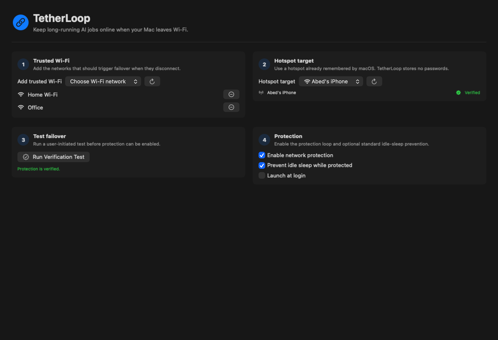
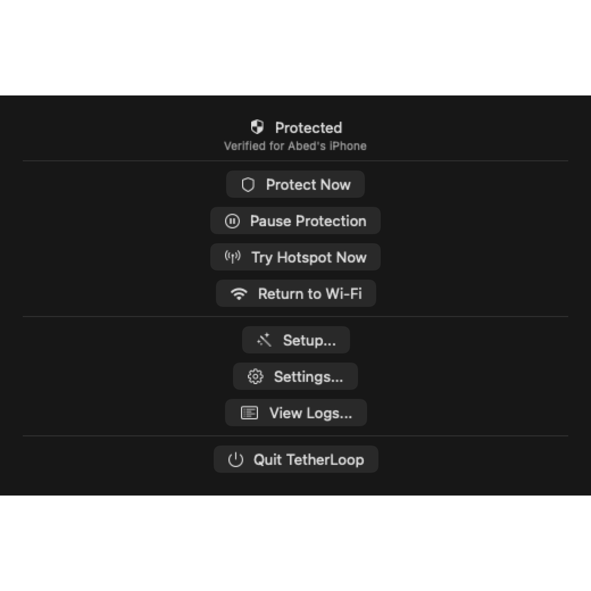
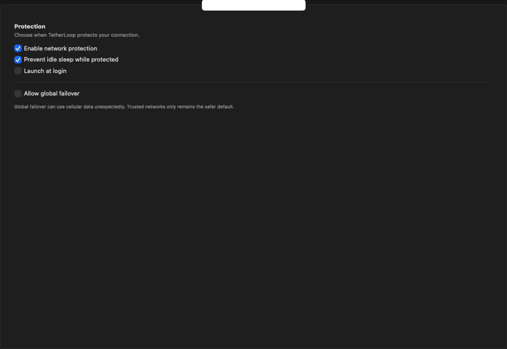
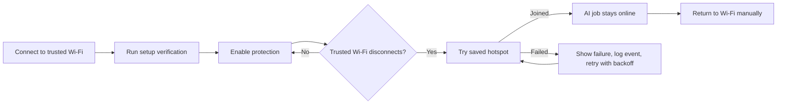

# TetherLoop

<p align="center">
  
</p>

<p align="center">
  <a href="https://www.swift.org/"></a>
  
  
  
  <a href="LICENSE"></a>
</p>

**Keep long-running AI jobs online when your Mac leaves Wi-Fi.**

TetherLoop is a native macOS menu bar app for developers running Claude Code, Codex, terminal agents, Cursor tasks, and other long-lived local jobs. When your Mac disconnects from a trusted Wi-Fi network, TetherLoop can attempt to join a hotspot that macOS already remembers.

It does not store hotspot passwords. It does not read terminal contents. It does not send telemetry.

## Why TetherLoop Exists

Keeping a Mac awake is easy. Keeping an active AI run online after you walk away from Wi-Fi is the part that still breaks.

TetherLoop is built for the exact moment where:

- your Claude Code, Codex, or terminal agent is still working,
- your Mac is still awake,
- you leave home, office, or coworking Wi-Fi,
- the session loses network and stalls before finishing.

Rather than acting like a generic Wi-Fi utility, TetherLoop focuses on one job: protect long-running developer work by failing over from trusted Wi-Fi to a saved hotspot.

## Screenshots

<table>
  <tr>
    <td width="50%">
      
    </td>
    <td width="50%">
      
    </td>
  </tr>
  <tr>
    <td align="center"><strong>Menu bar controls</strong></td>
    <td align="center"><strong>Settings and diagnostics</strong></td>
  </tr>
</table>

## What It Does

| Capability | What happens |
| --- | --- |
| Trusted Wi-Fi monitoring | Watches the networks you mark as trusted. |
| Hotspot failover | Attempts to join one hotspot SSID that macOS already has saved. |
| Setup verification | Requires a real verification test before protection can be enabled. |
| Manual recovery | Provides Protect Now, Pause Protection, Try Hotspot Now, and Return to Wi-Fi. |
| Sleep prevention | Optionally creates a standard macOS idle-sleep assertion while protected. |
| Local diagnostics | Keeps a bounded local event log for setup and failover debugging. |
| State notifications | Sends useful notifications when protection switches, succeeds, or fails. |
| Menu bar workflow | Runs as an icon-only menu bar app with compact status and controls. |

## How Failover Works



## Menu Commands

The README mirrors the same SF Symbol icon names used in the macOS menu. The screenshot above shows the rendered menu icons exactly as they appear in the app.

| App icon | Menu item | Use it when |
| --- | --- | --- |
| `link.badge.plus`, `wifi`, `shield.checkered`, `pause.circle`, `arrow.triangle.2.circlepath`, `antenna.radiowaves.left.and.right`, `exclamationmark.triangle` | Status row | See whether TetherLoop is unconfigured, monitoring, protected, paused, switching, on hotspot, or failed. |
| `wand.and.stars` | Start Setup / Setup | Add trusted Wi-Fi, choose a hotspot target, and run the verification test. |
| `shield` | Protect Now | Arm protection after setup has been verified. |
| `pause.circle` | Pause Protection | Stop automatic network switching when you do not want failover. |
| `antenna.radiowaves.left.and.right` | Try Hotspot Now | Manually attempt to join the saved hotspot. |
| `wifi` | Return to Wi-Fi | Move back to the last trusted Wi-Fi, or the first configured trusted network. |
| `gearshape` | Settings | Configure protection, networks, sleep prevention, and launch at login. |
| `list.bullet.rectangle` | View Logs | Inspect local diagnostic events. |
| `power` | Quit TetherLoop | Quit the menu bar app. |

## What It Does Not Do

TetherLoop is intentionally narrow in Free V1.

- It does not store Wi-Fi or hotspot passwords.
- It does not force-enable your phone hotspot.
- It does not read terminal contents, prompts, agent output, or command history.
- It does not send analytics, telemetry, crash reports, or cloud diagnostics.
- It does not promise closed-lid operation in Free V1.
- It does not install a privileged helper in Free V1.
- It does not replace your VPN, firewall, or general network manager.

## Requirements

- macOS 14 or newer
- Xcode command line tools or a Swift 6 toolchain
- A hotspot that has already been connected to from macOS
- At least one trusted Wi-Fi network configured in TetherLoop

## Install

Free V1 is source-first, but tagged builds can publish a downloadable app bundle.

1. Open the latest GitHub Release.
2. Download `TetherLoop.zip`.
3. Unzip it and move `TetherLoop.app` to `/Applications`.
4. Open TetherLoop.

Release builds are ad-hoc signed and not notarized yet, so macOS may require approval from **System Settings > Privacy & Security** the first time you open the app.

## Build From Source

Clone the repo:

```sh
git clone https://github.com/AbedMir31/tetherloop.git
cd tetherloop
```

Build and test:

```sh
swift build
swift test
```

Run the app:

```sh
swift run TetherLoop
```

Build a local `.app` bundle:

```sh
scripts/package-app.sh
open dist/TetherLoop.app
```

Generate README screenshots:

```sh
swift run GenerateScreenshots
```

## First-Time App Setup

1. Connect to your hotspot once using macOS System Settings so macOS owns the saved credentials.
2. Launch TetherLoop.
3. Open **Setup** from the menu bar app.
4. Add the Wi-Fi networks that should trigger protection when they disconnect.
5. Choose the hotspot target TetherLoop should join.
6. Run the verification test.
7. Enable network protection.
8. Optionally enable idle-sleep prevention and launch at login.

If setup verification fails, TetherLoop leaves protection disabled and writes a local diagnostic event so you can inspect what happened.

## Privacy Model

TetherLoop is built around a tight trust boundary:

- Hotspot credentials stay in macOS.
- Settings store SSID names and feature toggles.
- Diagnostics stay local in Application Support.
- Logs are bounded and designed for operational events, not terminal content.
- Networking, power, notifications, diagnostics, and settings all sit behind small adapters so behavior can be tested without touching your real network in unit tests.

## Architecture

TetherLoop keeps system effects behind narrow interfaces so the core behavior is testable.

| Area | Responsibility |
| --- | --- |
| `Settings` | Trusted SSIDs, hotspot target, setup verification, protection toggles, and launch at login. |
| `Protection` | Deterministic state machine, protection status, retry policy, and transition intents. |
| `Network` | Current SSID lookup, remembered network lookup, and saved-network join attempts. |
| `Power` | Standard macOS idle-sleep assertion adapter. |
| `Diagnostics` | Bounded local event log. |
| `Notifications` | State-change notification dispatch. |
| `UI` | Menu bar, onboarding, settings, and logs. |

## Project Layout

```text
Sources/
  TetherLoop/                 App entry point
  TetherLoopCore/
    App/                      App model and orchestration
    Core/                     Network, protection, power, settings, diagnostics
    UI/                       Menu bar, onboarding, settings, diagnostics views
  GenerateScreenshots/        Deterministic README screenshot generator
Tests/
  TetherLoopTests/            Unit tests for core behavior and adapters
assets/
  screenshots/                README and launch images
docs/
  marketing/                  Positioning and launch copy drafts
  prd/                        Technical PRD
```

## Development Commands

```sh
# Build all targets
swift build

# Run tests
swift test

# Launch the menu bar app
swift run TetherLoop

# Package an ad-hoc signed local app bundle
scripts/package-app.sh

# Refresh screenshots used by this README
swift run GenerateScreenshots
```

## FAQ

### Can TetherLoop turn on my iPhone hotspot?

No. Your hotspot needs to be visible and previously saved by macOS. TetherLoop attempts to join the saved hotspot SSID; it does not force your phone to enable hotspot mode.

### Does TetherLoop store my Wi-Fi password?

No. macOS stores remembered network credentials. TetherLoop stores SSID choices and setup state.

### Does it work with Claude Code, Codex, Cursor, and terminal agents?

Yes. TetherLoop does not need to know which agent is running because Free V1 protects the network path, not the terminal process. If the Mac leaves trusted Wi-Fi, TetherLoop tries the configured hotspot.

### Does it keep a Mac awake?

It can optionally prevent standard idle sleep while protection is enabled. Free V1 does not claim advanced closed-lid behavior.

### Does it send telemetry?

No. TetherLoop has no analytics pipeline and no cloud diagnostics.

### Why require a verification test?

Because a fake setup is worse than no setup. TetherLoop makes you prove the hotspot join works before it lets you rely on protection.

### Is there a signed release?

Tagged releases can publish an ad-hoc signed `TetherLoop.zip` for GitHub users. Apple Developer ID signing, notarization, auto-updates, and stronger install polish are part of the future release roadmap.

## Roadmap

Free V1 is the open-source core:

- trusted Wi-Fi failover
- one hotspot target
- setup verification
- idle-sleep prevention
- local diagnostics
- state-change notifications
- manual menu bar controls

Future Pro work may add:

- 7-day trial
- advanced closed-lid mode
- process/app guard automation
- multi-hotspot fallback
- smart auto-return
- hotspot data guard
- session detection
- CLI and Shortcuts support
- session timeline export
- signed builds and auto-updates

## Contributing

Issues and pull requests are welcome. The highest-value contributions are the ones that keep TetherLoop narrow, reliable, and trustworthy:

- improve failover reliability without storing credentials,
- improve diagnostics without collecting private data,
- add tests around state transitions and adapters,
- improve setup clarity,
- keep Free V1 honest about limitations.

Before changing behavior, run:

```sh
swift test
swift run GenerateScreenshots
```

## License

TetherLoop is released under the [MIT License](LICENSE).
